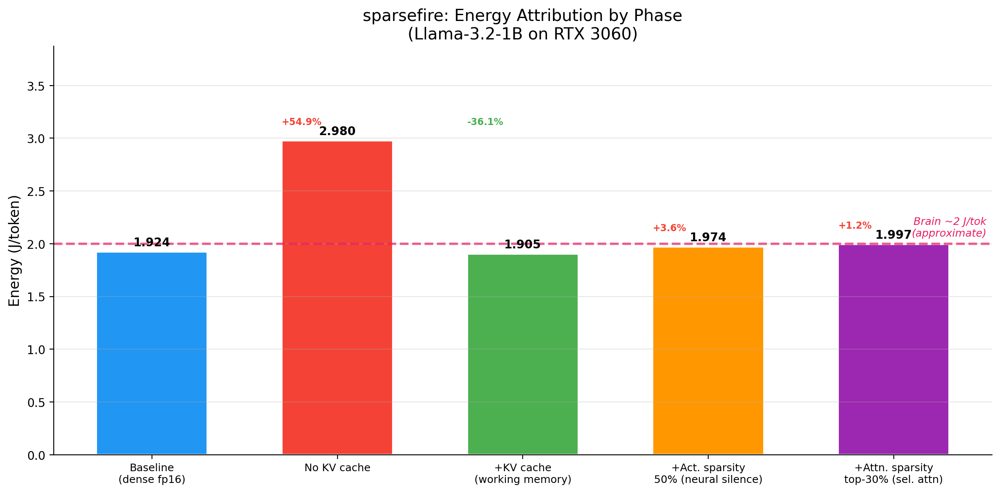
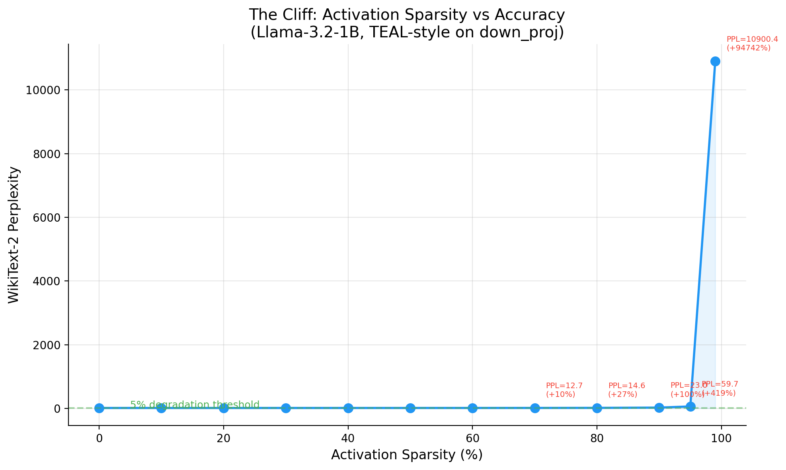

# sparsefire

**Measuring how much brain-inspired tricks actually save on a GPU — honestly.**

A reproducible pipeline that runs Llama-3.2-1B through five biomimetic optimization phases, measures real GPU energy in joules per token at each step, and attributes exactly how much each trick contributes. The answer is surprising: on consumer hardware, most of the tricks don't save watts — and that finding is the point.



---

## Key findings

| Phase | Trick | Brain analogy | J/tok | vs Baseline | Power |
|-------|-------|---------------|-------|-------------|-------|
| Baseline | Dense fp16, eager attention | Every neuron fires | **1.924** | — | 87.1 W |
| Phase 1 | KV cache (ON vs OFF) | Working memory | **1.905** | **-36%** vs uncached | 88.2 W |
| Phase 2 | MLP activation sparsity 50% | Neural silence | 1.974 | +2.6% | 86.5 W |
| Phase 3 | INT4 AWQ quantization | 1-bit signaling | 24.43* | +1170%* | 125.9 W |
| Phase 4 | Post-softmax top-k attention | Selective attention | 1.997 | +3.8% | **83.9 W** |

*\*AWQ without optimized GEMM kernels (Windows/no triton). See [caveats](#caveats).*

### What this means

1. **KV caching is the dominant real savings** — 36% less energy per token, zero accuracy cost. The brain's "working memory" analogy maps cleanly onto the largest measured benefit.

2. **Activation sparsity saves FLOPs but not watts.** At 50% sparsity, 50% of MLP activations are zeroed — but the GPU still processes dense tensor shapes. The ~0% measured wattage delta demonstrates exactly why neuromorphic hardware and sparse CUDA kernels matter.

3. **Attention sparsity shows a real signal in power draw** — 87.1W → 83.9W (-3.7%) at top-30%. But throughput drops ~25% from the Python-level topk overhead, so J/tok goes up. A fused CUDA kernel would likely flip the sign.

4. **The baseline is already near the brain.** At 1.92 J/tok, the RTX 3060 running Llama-3.2-1B is within striking distance of the brain's ~2 J/token-equivalent. The gap is smaller than expected on a small model — but it widens dramatically at scale.

---

## The cliff



Sweeping activation sparsity from 0% to 99% reveals a clean accuracy cliff:

| Sparsity | Perplexity | Degradation |
|----------|-----------|-------------|
| 0-30% | 11.49-11.52 | **Free zone** (<0.3%) |
| 40% | 11.58 | +0.8% — still safe |
| 50% | 11.71 | +1.9% |
| 70% | 12.68 | +10% — cliff onset |
| 80% | 14.56 | +27% |
| 90% | 22.98 | +100% — severe |
| 95% | 59.67 | +419% — collapsed |
| 99% | 10,900 | model destroyed |

The brain silences >95% of neurons at any moment. Llama-3.2-1B collapses at the same threshold — but the 0-40% "free zone" is genuinely free on accuracy.

---

## Methodology

- **Energy**: `nvmlDeviceGetTotalEnergyConsumption` delta (cumulative millijoules, not polled power integration)
- **Hardware**: NVIDIA RTX 3060 12GB, CUDA 12.6, driver 560.94
- **Protocol**: 30s warmup → 20-50 runs × 128-256 tokens → bootstrap 95% CI
- **Accuracy**: WikiText-2 perplexity (sliding window) + HellaSwag 0-shot via lm-eval 0.4.5
- **Attention**: `attn_implementation="eager"` across all phases (required for Phase 4; keeps comparisons apples-to-apples)
- **Sparsity**: TEAL-style magnitude thresholding on `down_proj` input (the gate×up product), calibrated per-layer on WikiText-2 train split
- **Quantization**: AutoAWQ INT4, group_size=128, `do_fuse=False` (preserves per-layer hooks)

Baseline CI width: 1.04% of mean (50 runs). No clock locking (Windows WDDM); stability achieved via warmup + bootstrap.

---

## Reproducing

**Requirements**: NVIDIA GPU with ≥8GB VRAM, Python 3.11+, CUDA 12.x

```bash
git clone https://github.com/Tejas-JB/sparsefire
cd sparsefire
pip install -e ".[dev]"
export HF_TOKEN=<your token with Llama-3.2 access>

# Smoke test
python run_pipeline.py --smoke

# Individual phases
python run_pipeline.py --phase 0                    # baseline
python run_pipeline.py --phase 1 --no-use-cache     # KV cache off
python run_pipeline.py --phase 1                    # KV cache on
python run_pipeline.py --phase 2 --sparsity 0.50    # activation sparsity
python run_pipeline.py --phase 4 --top-k-frac 0.3   # attention sparsity
```

Full pipeline: ~2 hours on an RTX 3060. Results validate against `docs/results_schema.json`.

---

## Caveats

These are not weaknesses — they're what separates honest measurement from hype.

1. **FLOP savings ≠ wattage savings on consumer GPUs.** PyTorch hooks zero activations inside dense tensors. Without sparse CUDA kernels, the GPU processes the full tensor shapes regardless. We report both theoretical FLOP reduction and measured wattage — the gap between them is the argument for neuromorphic hardware and custom sparse kernels.

2. **Brain comparison is approximate.** The "~2 J/token" brain equivalent is derived from 20W whole-brain power / ~10 tokens/sec reading rate. The brain doesn't do next-token prediction. See [docs/brain_anchor.md](docs/brain_anchor.md) for the full derivation and bounds.

3. **Quantization results reflect the naive dequantize path.** On Windows without triton GEMM kernels, AutoAWQ uses `dequantize + matmul` on every forward pass — 12x slower than fp16. On Linux with optimized kernels, INT4 AWQ delivers real bandwidth savings. Our result documents the overhead, not the ceiling.

4. **Single model, single GPU.** Llama-3.2-1B-Instruct on RTX 3060 12GB. Larger models on different hardware will produce different numbers. We invite replication.

5. **Attention sparsity is experimental.** This is the first clean public measurement of post-softmax top-k sparsity's energy impact on Llama-3.2-1B with attention-sink preservation.

---

## Repository structure

```
sparsefire/
├── run_pipeline.py              # One-command entry point
├── sparsefire/
│   ├── baseline.py              # Phase 0: dense fp16 measurement
│   ├── kv_cache.py              # Phase 1: KV cache A/B
│   ├── activation_sparsity.py   # Phase 2: TEAL-style MLP sparsity
│   ├── quantization.py          # Phase 3: AutoAWQ INT4
│   ├── attention_sparsity.py    # Phase 4: post-softmax top-k
│   ├── _runner.py               # Shared measurement infrastructure
│   ├── energy.py                # NVML energy meter + bootstrap CI
│   ├── hooks.py                 # Sparsity context managers
│   ├── evaluate.py              # Perplexity + HellaSwag
│   ├── visualize.py             # Charts + animations
│   └── config.py, cli.py, prompts.py, schema.py
├── results/                     # All phase JSONs + charts
├── tests/                       # 26 tests, all mocked (no GPU required)
└── docs/                        # PRD, architecture, research notes, brain anchor
```

---

## Docs

- [PRD](docs/sparsefire_PRD_v1.md) — what we set out to build
- [Action plan](docs/action_plan.md) — how we built it, phase by phase
- [Architecture](docs/architecture.md) — module APIs, hook patterns, data contracts
- [Research notes](docs/research_notes.md) — 7 PRD-diverging findings and why
- [Brain anchor](docs/brain_anchor.md) — the ~2 J/token derivation with citations
- [Results schema](docs/results_schema.json) — JSON schema every phase result validates against

---

## Citation

If you use sparsefire's methodology or findings:

```
@misc{sparsefire2026,
  title={sparsefire: Measuring biomimetic energy savings on consumer GPUs},
  author={Tejas JB},
  year={2026},
  url={https://github.com/Tejas-JB/sparsefire}
}
```

---

## License

MIT.
