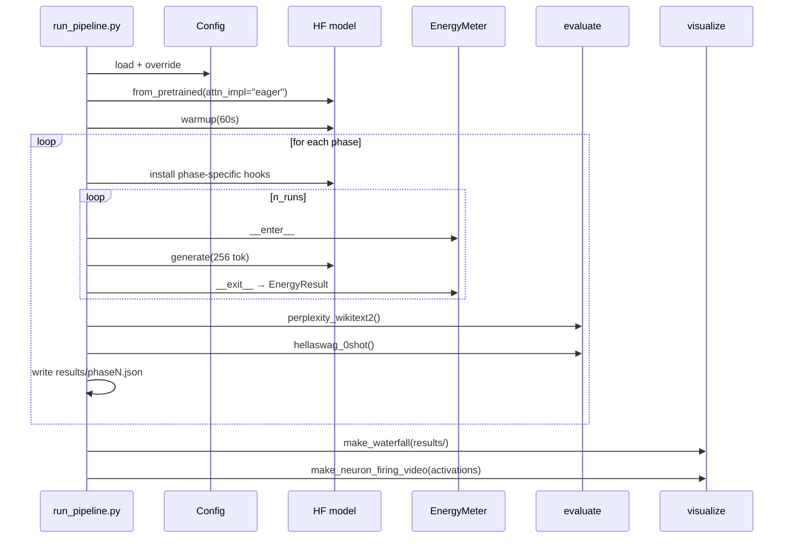

# sparsefire — architecture

This document freezes the module APIs and data contracts for the pipeline. Implementers (one per phase) copy signatures from here verbatim. Incorporates [research_notes.md](research_notes.md) findings.

---

## Stack

- Python 3.11
- PyTorch 2.5.x
- transformers 4.47.1 (pinned — AutoAWQ requires this exact version)
- accelerate, autoawq, nvidia-ml-py, lm-eval ≥0.4.5
- Target GPU: RTX 3090 (24GB, CUDA 12.4)

---

## Invariants that hold across every phase

1. Model loaded with `attn_implementation="eager"` (required for Phase 5; kept consistent for apples-to-apples).
2. `torch_dtype=torch.float16` on weights (except quantization phase which uses INT4 weights + fp16 activations).
3. `use_cache=True` in `generate()` except where a phase explicitly disables it (Phase 2 A/B).
4. Prompts drawn deterministically from WikiText-2 test split with `seed=0`.
5. Exactly 256 generated tokens per run; 50 runs per measurement.
6. Energy = `nvmlDeviceGetTotalEnergyConsumption(handle)` delta. Polled power trace kept as diagnostic only.

---

## `sparsefire.config.Config`

```python
from dataclasses import dataclass, field
from pathlib import Path

@dataclass(frozen=True)
class Config:
    model_id: str = "meta-llama/Llama-3.2-1B-Instruct"
    dtype: str = "float16"                       # weights dtype
    attn_impl: str = "eager"                     # "eager" | "sdpa"
    device: str = "cuda"
    seed: int = 0

    # Measurement protocol
    n_runs: int = 50
    n_tokens: int = 256
    n_prompts: int = 50
    warmup_s: int = 60
    sample_interval_ms: int = 50                 # diagnostic polling interval
    lock_clocks: bool = True                     # nvidia-smi --lock-gpu-clocks

    # Eval
    wikitext_split: str = "wikitext-2-raw-v1"
    hellaswag_batch_size: int = 8

    # Paths
    results_dir: Path = Path("results")
    hf_cache_dir: Path | None = None
```

Loadable from YAML via `Config.from_yaml(path)`; CLI overrides via `Config.override(**kwargs)`.

---

## `sparsefire.energy`

```python
class EnergyMeter:
    """Context manager wrapping a generation run.

    Uses nvmlDeviceGetTotalEnergyConsumption for primary energy delta.
    Also samples nvmlDeviceGetPowerUsage at sample_interval_ms for a
    diagnostic power trace (not used in primary energy calc).
    """

    def __init__(self, device_index: int = 0, sample_interval_ms: int = 50): ...

    def __enter__(self) -> "EnergyMeter": ...
    def __exit__(self, *exc) -> None: ...

    @property
    def result(self) -> "EnergyResult": ...


@dataclass
class EnergyResult:
    total_energy_j: float              # from nvmlDeviceGetTotalEnergyConsumption delta
    wallclock_s: float
    mean_power_w: float                # from polled trace
    peak_power_w: float
    power_trace_w: list[float]
    sample_interval_ms: int


def bootstrap_ci(
    values: list[float], n_bootstrap: int = 10_000, alpha: float = 0.05
) -> tuple[float, float, float]:
    """Return (mean, ci_low, ci_high) via bootstrap resampling."""


def lock_gpu_clocks(freq_mhz: int) -> None: ...
def unlock_gpu_clocks() -> None: ...
def warmup(model, tokenizer, seconds: int) -> None: ...
```

### Usage

```python
with EnergyMeter() as m:
    outputs = model.generate(**inputs, max_new_tokens=cfg.n_tokens, use_cache=True)
r = m.result
# r.total_energy_j, r.wallclock_s, r.mean_power_w
```

---

## `sparsefire.evaluate`

```python
def perplexity_wikitext2(
    model, tokenizer, split: str = "wikitext-2-raw-v1",
    stride: int = 512, max_length: int = 2048,
) -> float:
    """Standard sliding-window perplexity on WikiText-2 test set."""


def hellaswag_0shot(
    model_path_or_obj, batch_size: int = 8, device: str = "cuda:0",
) -> dict:
    """Returns {"acc": float, "acc_norm": float}.

    Shells out to `lm_eval --model hf --tasks hellaswag --num_fewshot 0`.
    If model is an in-memory object, saves to a tempdir first.
    """
```

---

## `sparsefire.phases` (shared contract)

Every phase module exposes:

```python
def run(cfg: Config, **phase_kwargs) -> dict:
    """Execute the phase, write results/<phase_name>.json, return the dict."""
```

The returned dict validates against [`docs/results_schema.json`](results_schema.json).

### Phase modules

| Module | `phase_kwargs` | Notes |
|---|---|---|
| `baseline.py` | — | Dense fp16 Llama-3.2-1B, eager attention, `use_cache=True`. |
| `kv_cache.py` | `use_cache: bool` | Runs both modes; output is a pair of results files. |
| `activation_sparsity.py` | `sparsity: float` (0.25, 0.40, 0.50, 0.70) | Calibrates thresholds on 512 WT2 samples, then measures. |
| `quantization.py` | `stack_sparsity: float \| None` | Loads AWQ INT4 (w/ `do_fuse=False`); optionally stacks act-sparsity on top. |
| `attention_sparsity.py` | `top_k_frac: float`, `stack_phases: list[str]` | Patches `nn.functional.softmax` inside LlamaAttention; preserves first token. |

---

## Hook registration pattern (context manager)

```python
from contextlib import contextmanager

@contextmanager
def sparse_mlp_hooks(model, thresholds: dict[int, float]):
    """Register forward_pre_hooks on layer.mlp.down_proj for each layer.

    thresholds: {layer_idx: magnitude_threshold}
    Hook intercepts args[0] (the gate*up product) and zeros |x| < threshold.
    """
    handles = []
    try:
        for i, layer in enumerate(model.model.layers):
            t = thresholds[i]
            def pre_hook(m, args, _t=t):
                x = args[0]
                return (x * (x.abs() > _t),) + args[1:]
            handles.append(layer.mlp.down_proj.register_forward_pre_hook(pre_hook))
        yield
    finally:
        for h in handles:
            h.remove()
```

Matches TEAL's hook site: `down_proj` input = `gate_proj(x) * act_fn(up_proj(x))`.

### Attention sparsity pattern

Transformers 4.47's eager `LlamaAttention.forward` calls `torch.nn.functional.softmax`. We don't hook the module (output tuple often doesn't expose weights cleanly post-refactor) — we monkeypatch softmax inside a context manager, scoped per forward call by checking tensor shape.

```python
@contextmanager
def sparse_attention(top_k_frac: float, preserve_first_token: bool = True):
    """Replace F.softmax with a top-k-then-renormalize variant for the duration
    of this block. Only activates on 4D tensors of attention-weight shape."""
    import torch.nn.functional as F
    original = F.softmax

    def patched_softmax(x, dim=-1, **kw):
        w = original(x, dim=dim, **kw)
        if w.ndim != 4:                       # not attention weights
            return w
        k = max(1, int(w.shape[-1] * top_k_frac))
        topk, _ = w.topk(k, dim=-1)
        threshold = topk[..., -1, None]
        mask = w >= threshold
        if preserve_first_token:
            mask[..., 0] = True
        w = w * mask
        return w / w.sum(dim=-1, keepdim=True).clamp_min(1e-9)

    F.softmax = patched_softmax
    try:
        yield
    finally:
        F.softmax = original
```

---

## Calibration for activation sparsity

```python
def calibrate_thresholds(
    model, tokenizer, target_sparsity: float,
    n_samples: int = 512, seq_len: int = 2048,
) -> dict[int, float]:
    """Capture `down_proj` input magnitudes across n_samples WT2 calibration
    texts. Per-layer threshold = (target_sparsity * 100)th percentile of
    |activation|. Returns {layer_idx: threshold}.
    """
```

---

## CLI

```bash
python run_pipeline.py --phase 0              # baseline
python run_pipeline.py --phase 2 --sparsity 0.40
python run_pipeline.py --all                  # runs 0..6 sequentially
python run_pipeline.py --cliff                # sparsity 0..0.99 sweep
```

---

## Sequence (end-to-end)


